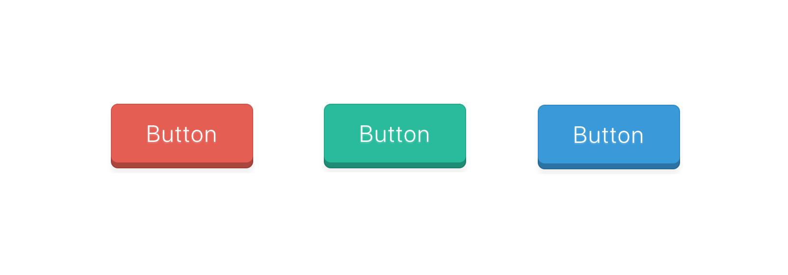

# PUSHY BUTTONS


> A small CSS Pressable Buttons library.

- Any contributions are more than welcome. 🤗

### Demo

Checkout the [Demo](https://iraul.github.io/pushy-buttons/) to see the buttons in action.

### Setup & Installation
1. Download it.
2. Include buttons in your website:

```html

  <!-- Buttons Core -->
  <link rel="stylesheet" href="css/pushy-buttons.css">

  <!-- Or -->

  <!-- Minified Version -->
  <link rel="stylesheet" href="css/pushy-buttons.min.css">
```
### Examples
- There are 4 sizes and 3 colors available.
- You can customize them in the `.scss` file if you want.

```html
<!-- Blue Buttons -->
<button class="pushy__btn pushy__btn--lg pushy__btn--blue">Button</button>
<button class="pushy__btn pushy__btn--df pushy__btn--blue">Button</button>
<button class="pushy__btn pushy__btn--md pushy__btn--blue">Button</button>
<button class="pushy__btn pushy__btn--sm pushy__btn--blue">Button</button>

<!-- Green Buttons -->
<button class="pushy__btn pushy__btn--lg pushy__btn--green">Button</button>
<button class="pushy__btn pushy__btn--df pushy__btn--green">Button</button>
<button class="pushy__btn pushy__btn--md pushy__btn--green">Button</button>
<button class="pushy__btn pushy__btn--sm pushy__btn--green">Button</button>

<!-- Red Buttons -->
<button class="pushy__btn pushy__btn--lg pushy__btn--red">Button</button>
<button class="pushy__btn pushy__btn--df pushy__btn--red">Button</button>
<button class="pushy__btn pushy__btn--md pushy__btn--red">Button</button>
<button class="pushy__btn pushy__btn--sm pushy__btn--red">Button</button>
```
## Author

**Raul Dronca**

* https://twitter.com/raul_dronca
* https://github.com/iRaul
* [Buy me a coffee ☕️](https://www.buymeacoffee.com/rauldronca)

## License

[](https://creativecommons.org/publicdomain/zero/1.0/)
